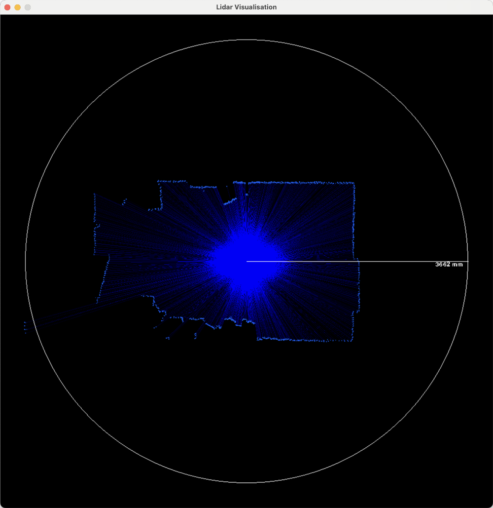

# OKDO LIDAR_LD06 library for RP2040

This provides a driver for interfacing with the OKDO LIDAR_LD06 module, which
is an extremely inexpensive, and pretty capable, time-of-flight lidar sensor.

The sensor produces 4500 points/second, with a configurable sweep rate,
allowing more/less angular resolution, traded off against refresh rate.
The default scan rate is 10Hz, giving around 0.9 degree angular resolution,
10 times/second.

The LIDAR continuously outputs packets on its serial output, which must be
processed in a timely manner - there is no way to slow down or stop the data
coming from the sensor.

The LIDAR produces one packet every ~2.8ms.

This library provides entirely DMA-and-interrupt driven processing for capturing
the data from the LIDAR and validating the packets with their CRC values.
Valid received packets are passed to a user-provided callback, so you can do
what you want with them (for example, put them into a queue and handle them
from your main thread).

## Basic Usage

Choose a UART RX-capable pin (refer to https://pico.pinout.xyz/) for receiving
the data, and optionally a PWM-capable pin for controlling the scan rate
(API for that is still TODO!)

Wire the LIDAR `DATA` pin to the UART RX, and `CTL` to the PWM.

Provide a callback for each received frame:

```c
#include <stdio.h>

#include "pico/stdlib.h"

#include "lidar.h"

void frame_cb(void *cb_data, struct lidar_frame *frame)
{
	// Note: Don't spend too long in this callback or you will drop frames!
	// You need to return from this callback before the UART FIFO fills up.
	// It's a good idea to just add the frame to a queue in this callback,
	// then do any further processing elsewhere.
	printf("ts: %d\n", frame->timestamp);
}

void main(void) {
	stdio_init_all();

	struct lidar_hw lidar;
	struct lidar_cfg lidar_cfg = {
		.uart_pin = 5,
		.pwm_pin = 2,
		.frame_cb = frame_cb,
		.frame_cb_data = NULL, // Use this to pass something to your callback
	};

	lidar_init(&lidar, &lidar_cfg);

	for ( ;; ) {
		tight_loop_contents();
	}
}
```

## Example(s)

Under `example/` is an example application which makes the LIDAR data available
over USB. It exposes two different (sets of) USB interfaces, which gives
access to the data in two different formats.

You should be able to use both interfaces simultaneously, though I don't know
why you would!

### USB Serial Interface (angle, distance)

The first and simplest interface is a USB serial port which continuously
outputs `(angle, distance_mm)` as quickly as samples are received from the
sensor. This should show up like any other USB<->Serial converter.

For example, on my machine:
```
$ picocom /dev/tty.usbmodem1101
198.58, 262
199.41, 258
200.24, 263
201.98, 241
202.78, 241
203.58, 244
204.38, 246
205.18, 243
205.98, 242
206.78, 235
207.58, 240
208.38, 240
209.18, 234
209.98, 231
210.78, 237
```

The `tools/visualise.py` script can be used to show a visual representation of
this data. It needs `pyserial` and `pygame` to be installed.

Run it like so (with the correct serial device name):
```
$ python3 tools/visualise.py -p /dev/tty.usbmodem1101
```



### Custom raw interrupt endpoint

The other is an INTERRUPT endpoint which sends the raw `struct lidar_frame`s as
they come off the sensor - this provides more information for processing on the
host. This isn't practically that useful, it effectively turns the Pico into a
complex USB<->Serial adapter for the LIDAR, but it illustrates handling the
data. Also, it only outputs frames which pass CRC validation.

The `tools/usb_raw.py` script shows an example of how to use this interface,
though it doesn't do anything useful with the data. It requires `pyusb`.

On Mac OS, if you installed `pyusb` via Homebrew, and you get an error that no
backend can be found, then you likely need to set the environment variable:
`DYLD_LIBRARY_PATH=/opt/homebrew/lib`.

Simply run the script, it will search for the device by VID/PID. Note that it
uses a generic Raspberry Pi Pico VID/PID, so make sure you only have one Pico
plugged in!

```
python3 tools/usb_raw.py
```
